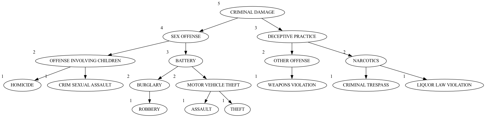

# ChicagoCrimeFun (CSCI 204 Final Project)
## Matt, Ramon, Zhengkai

A Chicago crime data dispatch system to help officers arrest more people to further fuel mass incarceration. Got to love America. 

## Requirements:
* `make`
* `python3` (and `pip`)

## Setup:
`make setup`
* Install graphiz package for your OS (ubuntu might have a seperate graphviz-devel?)

## Format (the code):
`make format`

## Run:
* `make` (or `make run`) - to test our `ChicagoCrime.py` file, which, at the moment, outputs some metadata about the CSV :shipit:
* `make web` - serves the flask app
* `make test` - small script w/ made-up data to test the ADT

## AVL Tree:
The AVL tree now correctly balances the tree after each insertion. The tree also correctly prioritizes the values of each node.
The way we did this was by now keeping track of a parent node which helped us keep track of the node we were setting as our pivot and rotating.
The visualization of the tree is now done by graphviz because it was a easy way to visualize the tree. We have tried other visualization packages but they were not as easy to visualize since the code was not working properly. 

## Testing:
Using print statements and the debugging tool that visual studio code provides. We also created a test_adt.py file which tests the ADT.

## Phase 1 Visualization:

Heatmaps of crime types:  

## Phase 2 Visualization:

Tree visualizations!

## Phase 3 Visualizations:

(Web app)

## Refactoring & Comments

## Police Station Placement Design

### An approach
To place police stations, we would likely write a method to find the GPS coordinates of each indcident of a given type. (For example, `ROBBERY`)
Then, we could use a FastPriorityQueue to store each pair under it's priority ranking.
Finally, we can average all elements of each priority tier. These datapoints would then be considered the rough geographic center of each type. 
Depending on the number of stations desired, you could either:
* average the datapoints, to get one rough geographic center of crime
* or, use those location points as new stations

### Caveat
Obviously, option 1 above would result in a massive station that's roughly in the center of the whole city, so that might not be particuarally useful.
However, the second option could potentially yield new insight, and hence be useful in staging resources near enough the potential location for, say, vehicle hijacking so that a response could be made in time.

## Outside resources related to dataset
* https://news.wttw.com/sites/default/files/Map%20of%20Chicago%20Police%20Districts%20and%20Beats.pdf