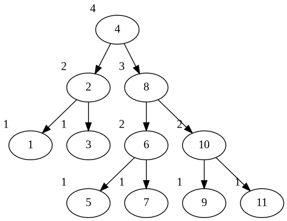

# ChicagoCrimeFun (CSCI 204 Final Project)
## Matt, Ramon, Zhengkai

A Chicago crime data dispatch system to help officers arrest more people to further fuel mass incarceration. Got to love America. 

## Requirements:
* `make`
* `python3` (and `pip`)

## Setup:
`make setup`
* Install graphiz package for your OS (ubuntu might have a seperate graphviz-devel?)

## Format (the code):
`make format`

## Run:
* `make` (or `make run`) - to test our `ChicagoCrime.py` file, which, at the moment, outputs some metadata about the CSV :shipit:
* `make web` - serves the flask app
* `make test` - small script w/ made-up data to test the ADT

## Outside resources related to dataset
* https://news.wttw.com/sites/default/files/Map%20of%20Chicago%20Police%20Districts%20and%20Beats.pdf

## AVL Tree:
The AVL tree now correctly balances the tree after each insertion. The tree also correctly prioritizes the values of each node.
The way we did this was by now keeping track of a parent node which helped us keep track of the node we were setting as our pivot and rotating.
The visualization of the tree is now done by graphviz because it was a easy way to visualize the tree. We have tried other visualization packages but they were not as easy to visualize since the code was not working properly. 

## Testing:
Using print statements and the debugging tool that visual studio code provides. We also created a test_adt.py file which tests the ADT.

## Phase 1 Visualization:

## Phase 2 Visualization:

